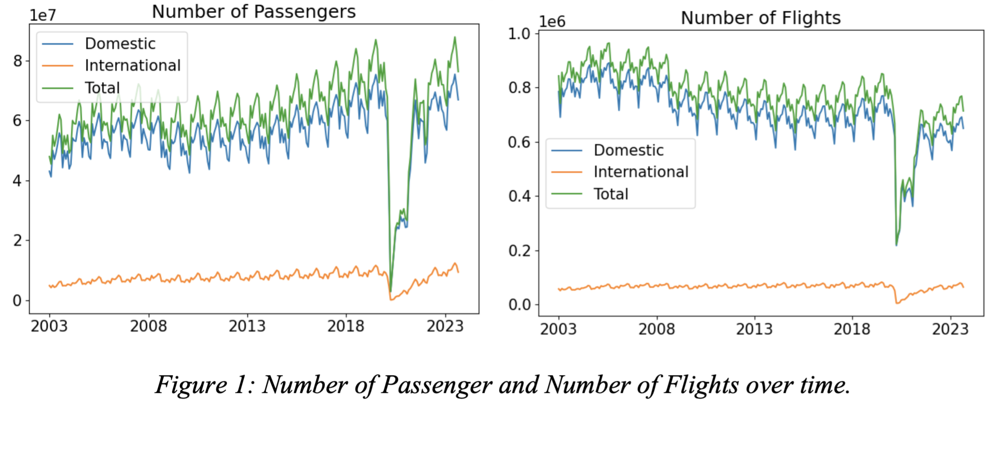

# Time Series Analysis of US Air Traffic Data

### CS 539 - Machine Learning
### Worcester Polytechnic Institute, Spring 2024

## Overview

In this paper, we perform a Time Series Analysis on U.S. Air Traffic data from the years 2003 to 2023. We explore the distribution of the data in order to identify trends and seasonality. We implement a SARIMA model and an LSTM model to forecast the number of passengers in future months, and compare the performance of the two models. Finally, we run a t-test to determine if there is a difference in the number of passengers in the year before the pandemic versus the year after the pandemic.

## Summary

In this project, we determined that there is a difference in the number of passengers in the years before the COVID-19 pandemic versus the years after the pandemic. We also create two forecasting models, a SARIMA model and an LSTM model. We find that the LSTM model does a better job of predicting the number of passengers in the future.

## Project Description

### Motivation

The COVID-19 pandemic affected our lives in many ways, one of the biggest being air travel. Restrictions on travel forced many people to stay home, and as a result, the air traffic industry suffered for about a year. Now, in 2024, travel restrictions have been lifted, but how has the pandemic affected air traffic today? Are more people traveling as a result of restrictions being lifted? Or are people now more scared to travel than previously?

### Goals

The main goal of this project is to explore U.S. air traffic data in order to identify trends and seasonality. We would like to build a forecasting model to predict the number of passengers on U.S. flights in future months. Finally, if we can, we would like to determine if there is a difference in the number of passengers flying in the years before the pandemic versus in the years after the pandemic.

### Dataset

The dataset we will be using for this project provides details on the monthly U.S. airline traffic from 2003 to 2023 for all commercial U.S. air carriers. The data comes from the U.S. Department of Transportation’s (DOT) Bureau of Transportation Statistics. The dataset contains 250 observations (each month from the years 2003 to 2023) and has 17 columns. For each month, the dataset contains information on the number of domestic air travel passengers, the number of international air travel passengers, the number of domestic flights, the number of international flights, the number of passengers and the distance flown (Revenue Passenger-miles) for both domestic and international flights, the number of seats and the distance flown (Available Seat-miles) for both domestic and international flights, and the passenger-miles as a proportion of available seat-miles (Load Factor) for both domestic and international flights.

[Source](https://www.kaggle.com/datasets/yyxian/u-s-airline-traffic-data)

## Methods

### Exploratory Data Analysis

We began our time series analysis by doing some Exploratory Data Analysis (EDA). Before doing any EDA, however, we have to make sure we aren’t missing any values and that each of the features is the correct data type. We also label encoded the Year feature.

After cleaning the data, we plotted histograms (see Figure 1 in Appendix) to take a look at the distribution of each variable. We found that they all seem to be slightly skewed to the left, likely due to the COVID-19 pandemic, during which there was much less air traffic than normal. Next, we plotted each of the variables over time for both domestic and international data, as well as the totals. This way, we were able to compare domestic versus international distribution. We found that many more people travel domestically than internationally. We also found that the total (domestic and international) number of passengers is increasing over time while the number of flights is going down over time (see Figure 1). This suggests that either flights are able to hold more people or that the flights have fewer empty seats.

We also plotted each of the variables over the months so we could try to identify if there is any seasonality in the data. These plots can be seen in Figure 4 of the Appendix. There does seem to be seasonality where you’d expect it. Air travel starts to pick up in the spring and peaks in the summer, dropping off again around September, and finally picking up again during the holidays. This can also be seen in the month-wise box plots we created (see Figure 2). In the year-wise box plots, you can see an overall positive trend (not including the years 2020 and 2021). Finally, we created a correlation matrix (see Figure 3 in the Appendix) to see how the features are related to each other. As we could already tell from the plots, the Number of Passengers is correlated to the Revenue Passenger-Miles, the Available Seat-Miles, and the Load Factor. This makes sense since these variables are all dependent on the number of passengers.

Based on this EDA, we will be using the number of passengers as our target variable as it represents our research question most accurately.

### Hypothesis Test

We want to see if there is a difference in the number of passengers before the COVID-19 pandemic versus after the pandemic. To do this, we will run a paired t-test on the number of passengers in the months before the pandemic and the months after. For this test, we will say that the period of restricted air travel lasted from 2020 through 2021 (it likely lifted sooner, but we will use a wider interval to be safe). We will look at the year before this period (2019) and the year after (2022). The null hypothesis is that there is no difference in the number of passengers before the pandemic and after the pandemic. The alternative hypothesis is that there is a difference.
The p-value for this test is less than alpha (5%), so we have sufficient evidence to reject the null hypothesis that the number of passengers is the same in these two periods. Therefore, we can conclude that there is a difference in the number of passengers before the pandemic versus after the pandemic. However, we don't know what this difference is. Let’s see if we can create a model to forecast the number of passengers in the future. 

### SARIMA Model

We have decided to use an Autoregressive Integrated Moving Average (ARIMA) model to forecast our data. ARIMA is an algorithm for forecasting that takes into account past values (both autoregressive and moving average) in order to predict future values based on that (Bajaj 2023). The integrated piece refers to the number of times the data has been differenced in order to make it stationary. 

Before creating our forecasting model, let’s decompose the data into trend, seasonality, and residuals. The results of this decomposition are shown below in Figure 3. The COVID-19 outliers make it difficult to tell, but it looks like the residuals are fairly random. There is definitely both trend and seasonality present in the data. Due to this, we will use the Seasonal ARIMA model (SARIMA) to build our forecasting model.

As you can see, these outliers are skewing our data distribution and making it difficult to come to conclusions. In order to fix this, we are going to find all the outliers and replace them with the average number of passengers for that month (excluding the outliers). 

Now that we have dealt with the outliers, we are almost ready to build our forecasting model. However, in order to build a SARIMA model, we must ensure that the data is stationary. To check this, we will use the Augmented Dicky-Fuller test. If the data is not stationary, we can difference it by subtracting the current value of the series from the previous one, or from a lagged value. The p-value resulting from our Augmented Dicky-Fuller test is 0.008, so we have sufficient evidence to reject the null hypothesis that the data is nonstationary. 

Finally, we plot the Autocorrelation Function (ACF) and Partial Autocorrelation Function (PACF) to determine which hyperparameters to use for our SARIMA model. These plots are shown above. Again, we can see the seasonality in the autocorrelation plot. We determine that the period is twelve months (yearly). The ACF plot suggests that we use a q value of four or five, and the PACF plot suggests a p value of two. The value of d will be our differencing value, in this case zero. However, when we create a model with these hyperparameters, it doesn’t perform well on the training data. 

Another way to decide on hyperparameters is by grid search. We perform a grid search with the hyperparameters order = (p,d,q) and seasonal order = (P,D,Q,s). We already know s=12 because our seasonality is yearly. Our grid search returns the parameters order = (2,1,0) and seasonal order = (0,1,1,12). We create a SARIMA model with these parameters; the results are below in the [Results](#results) section.

### LSTM Model

We decided to also try using a Long Short-Term Memory (LSTM) neural network to forecast our data. LSTM is a Recurrent Neural Network (RNN) architecture that excels at capturing long-term dependencies (Saxena 2024). The architecture incorporates feedback connections, allowing the model to process entire sequences of data rather than individual data points. This makes it ideal for time series data. 

We will phrase this problem as a regression problem: given the number of passengers this month, what is the expected number of passengers next month? In order to do this, we create a function that creates two columns of data: one column containing the number of passengers for this month, t, and one column containing the number of passengers next month, t+1. The first column is your x and the second column is your y. LSTM models also require us to do some data preprocessing, as they are very sensitive to the scale of input data. Because of this, we have to scale the data to a range of [0,1].

We build our LSTM network with one input layer, a hidden layer with 4 LSTM blocks, and an output layer that makes a single value prediction. We used the default activation function for each LSTM block, which is the sigmoid function. We trained it for 100 epochs using the Adam optimizer. The results of this model can be seen in the [Results](#results) section below. 

## Conclusion 

### Results

The results of our SARIMA model can be seen in Table 1 of the Appendix. The residuals and residual density plots are shown in Figure 5 of the Appendix. While there do seem to be a few outlying residuals, they seem mostly random and the distribution is normal. To evaluate our SARIMA model, we will be using Mean Absolute Percentage Error (MAPE). We chose this metric because it is easy to interpret, as it tells you how much, on average, your predictions differ from the actual values in percentage terms. The MAPE for the training data is 8.5%, while the MAPE for the test data is 13.1%. A MAPE of below 10% indicates that your forecasting model performs very well, while a MAPE value between 10% and 20% indicated a good forecasting model. Thus, our SARIMA model seems to do well on both the training and test data.

Let’s see how the forecasted values look compared to the actual values. Figure 5 below shows the actual number of passengers versus the forecast from our SARIMA model.

As you can see, the model does fairly well on the training data, but is a bit off with the test data. What is more concerning is the size of the confidence interval that the model produces. Let’s take a look at how the LSTM model does at forecasting our data. The actual number of passengers versus the forecasted number of passengers is shown in Figure 6 below. This model also does fairly well. It is able to capture the pattern and trends of the data, however, the forecasted number of passengers is less than the actual number of passengers for a majority of the data.

Our LSTM model achieves a MAPE of 13.4% on the training data and a MAPE of 6.5% on the test data. The difference in these values (normally the train would be smaller) might be due to the size of our test set. It might have been better to test on a larger sample, but we didn't want the COVID-19 data to be in the test set. Finally, we plotted the loss to ensure that the neural network was converging. This plot can be seen in Figure 6 in the Appendix.

### Discussion

Both of these forecasting models do a pretty good job at forecasting the number of passengers. The LSTM model does a bit better on the test dataset. One interesting thing we noticed is that the model's prediction on the test set is lower than the actual values for both models. This may indicate that there is, in fact, an increase in air travel that even the model might not realize due to the fact that it was trained on past data.

Another interesting thing we found in our EDA is that the number of flights decreases over the years while the number of passengers increases. This might mean that airplanes are able to hold more passengers, or that flights are more often fully booked. We also noticed that there are much fewer international flights than domestic flights. Finally, we saw the yearly trends of the data, noticing how the number of passengers increases in the spring and summer as people begin traveling, and then drops off around September when kids are starting to go back to school. There is another increase around Christmas, as you'd expect.

Our paired t-test showed that there is a difference in the number of passengers in the period before the COVID-19 pandemic versus the period after the pandemic. From the EDA and the forecasting predictions, it seems that this difference is an increase.

## References

[ARIMA & SARIMA: Real-World Time Series Forecasting](https://neptune.ai/blog/arima-sarima-real-world-time-series-forecasting-guide)

[A Gentle Introduction to Autocorrelation and Partial Autocorrelation](https://machinelearningmastery.com/gentle-introduction-autocorrelation-partial-autocorrelation/)

[How to Grid Search SARIMA Hyperparameters for Time Series Forecasting](https://machinelearningmastery.com/how-to-grid-search-sarima-model-hyperparameters-for-time-series-forecasting-in-python/)

[Time Series Prediction with LSTM Recurrent Neural Networks in Python with Keras](https://machinelearningmastery.com/time-series-prediction-lstm-recurrent-neural-networks-python-keras/)

[An End-to-End Project on Time Series Analysis and Forecasting with Python](https://medium.com/towards-data-science/an-end-to-end-project-on-time-series-analysis-and-forecasting-with-python-4835e6bf050b)

[Time Series Analysis: Definition, Components, Methods, and Applications](https://www.analyticsvidhya.com/blog/2021/10/a-comprehensive-guide-to-time-series-analysis/)

[The Complete Guide to Time Series Analysis and Forecasting](https://medium.com/towards-data-science/the-complete-guide-to-time-series-analysis-and-forecasting-70d476bfe775)

[Time Series Analysis in Python – A Comprehensive Guide with Examples](https://www.machinelearningplus.com/time-series/time-series-analysis-python/)

[ARIMA Model – Complete Guide to Time Series Forecasting in Python](https://www.machinelearningplus.com/time-series/arima-model-time-series-forecasting-python/)

[What is LSTM? Introduction to Long Short-Term Memory](https://www.analyticsvidhya.com/blog/2021/03/introduction-to-long-short-term-memory-lstm/)
